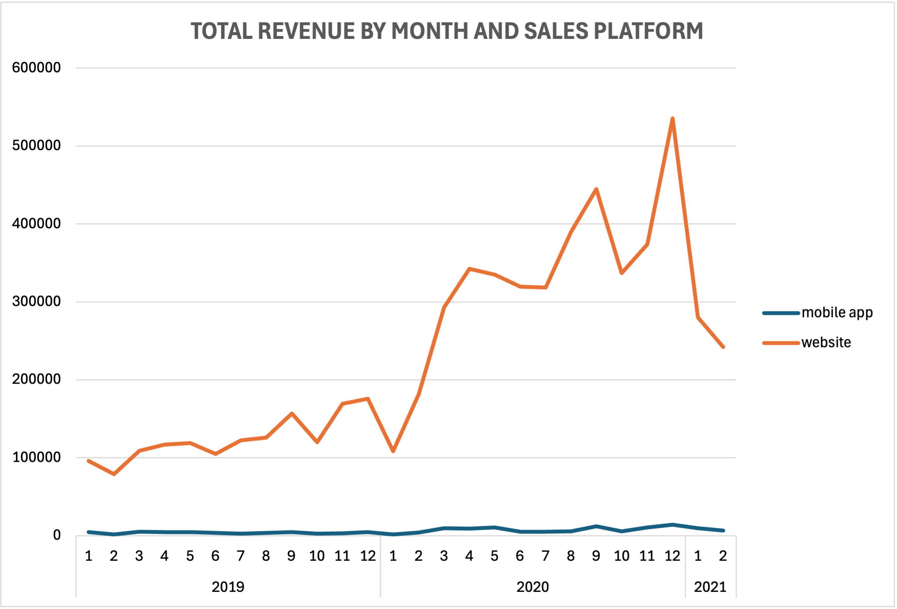
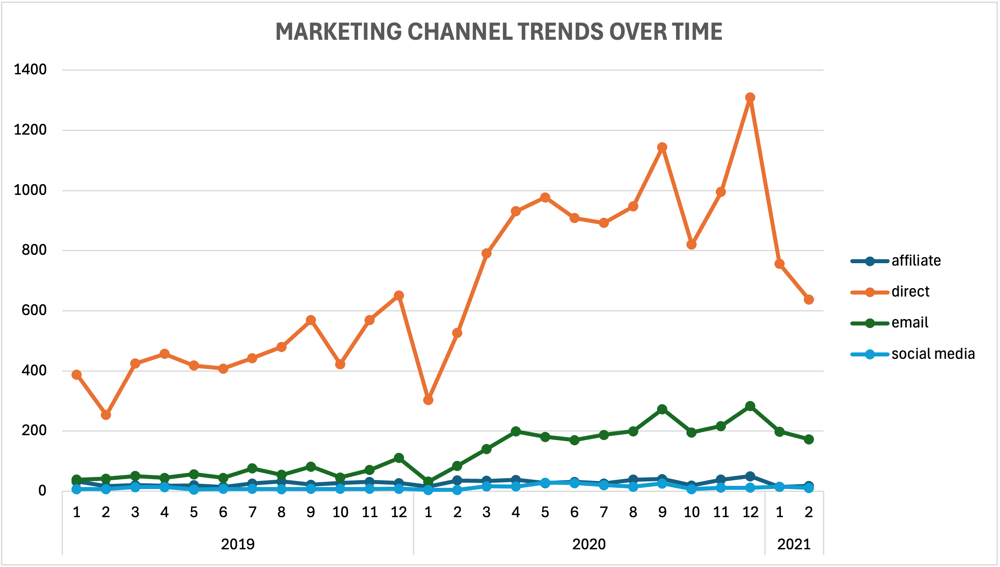
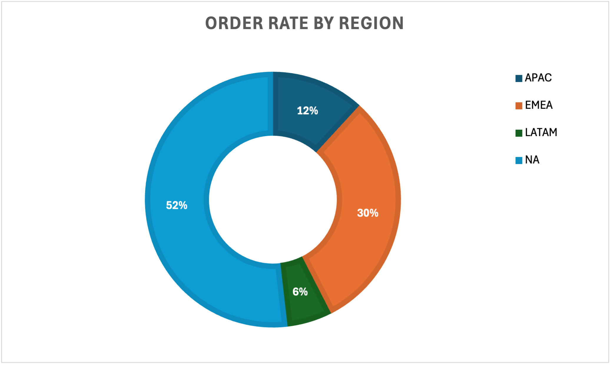
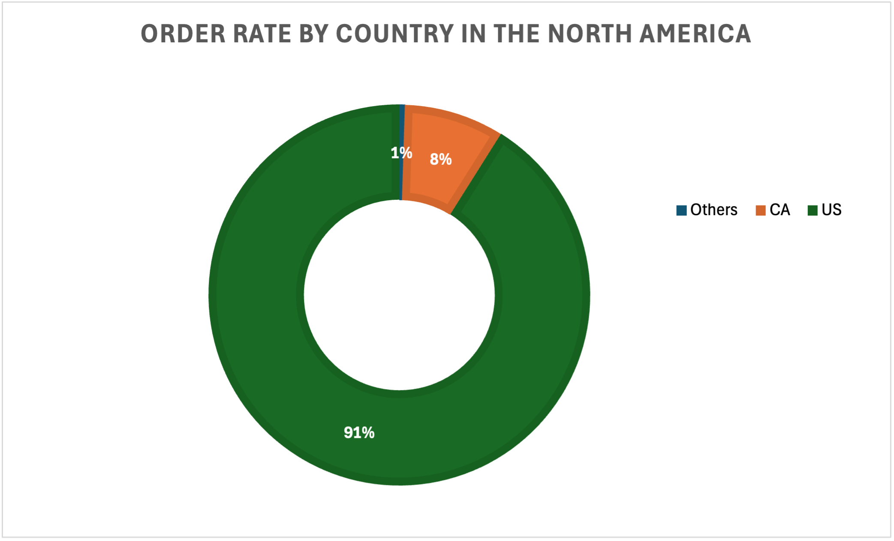
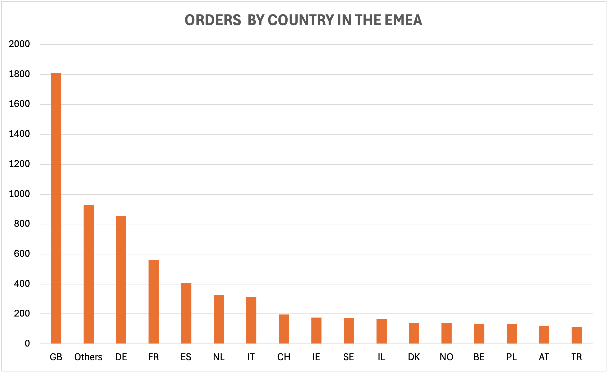
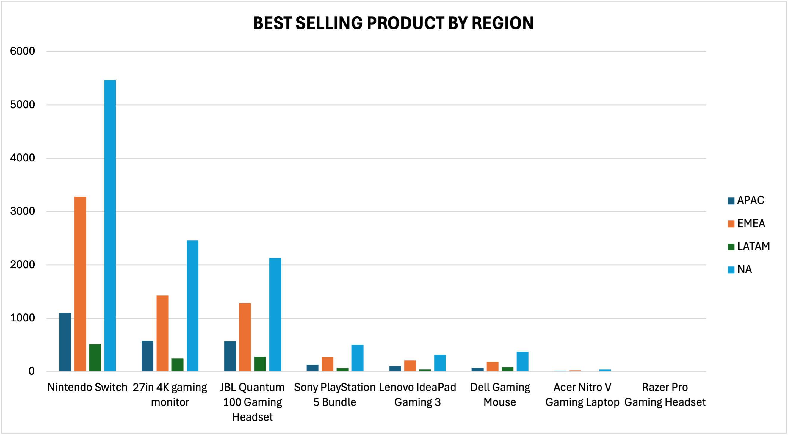
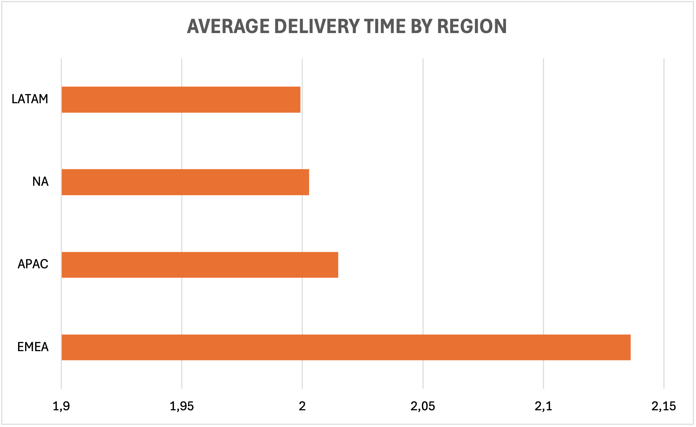
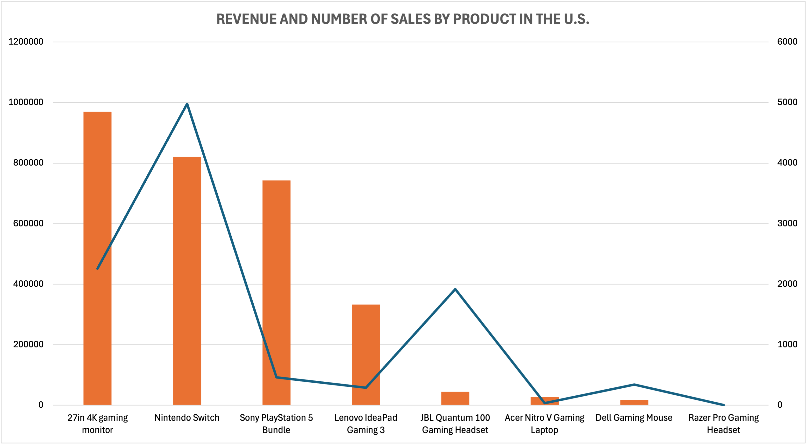
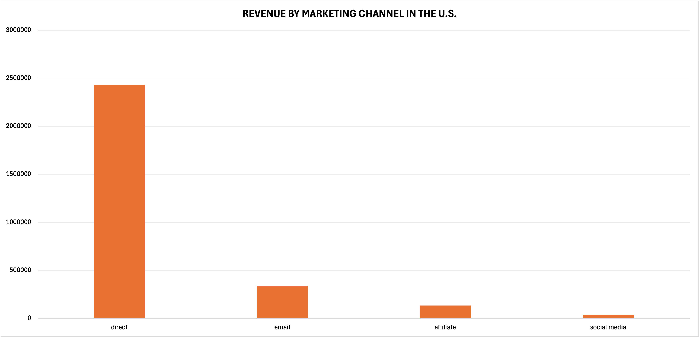

# Game Store Sales Analysis 

## Project overview

### Objective  
To analyze historical sales data from a game store and uncover insights regarding sales trends, product performance, regional behaviors, and marketing effectiveness to support better commercial and strategic decisions.

### Business context  
The store operates across several global regions with both online (website, mobile) and offline (in-store) sales channels. Understanding how sales vary over time and across regions, platforms, and marketing channels is essential for **allocating resources**, **planning seasonal promotions**, and **targeting customer segments more effectively**.

---

## Dataset structure

The analysis was based on an Excel file with two sheets:

### 1. `orders`

### 2. `region`
A reference sheet mapping country codes to broader regions (e.g., NA, EMEA, APAC)

---

## Data cleaning summary

An **issue log** was created to document data quality issues and solutions:

| Table | Column(s) | Issue | Rows affected | Magnitude | Solvable | Resolution |
|-------|-----------|-------|----------------|----|---------|------------|
| orders | `purchase_ts` | Inconsistent formats | 10 | 0.05% | ✅ | used `DATE` functions to reformat the dates correctly|
| orders | `purchase_ts` | Missing | 1 | 0.00% | ❌ | Left as-is (low magnitude and no way to infer) |
| orders | `product_name` | Spelling inconsistency | 61 | 0.28% | ✅ | Standardized naming |
| orders | `product_id` | Inconsistent format | 722 | 3.30% | ✅ | Used `TEXT` functions to reformat correctly|
| orders | `usd_price` | Missing / 0 value | 34 | 0.16% | ❌ | Flagged for review |
| orders | `marketing_channel` | Missing | 83 | 0.38% | ✅ | Replaced with "unknown" |
| orders | `account_creation_method` | Missing | 83 | 0.38% | ✅ | Replaced with "unknown" |
| orders | `country_code` | Missing | 37 | 0.17% | ❌ | Left as-is (no way to infer, need to check with stakeholders |
| regions | `region` | Invalid / missing | 9 | 0.04% | ✅ | Filled via lookup |
| orders | `purchase_ts`, `ship_ts` | Ship before purchase | 2,000 | 9.15% | ❌ | Flagged only |
| orders | all | Duplicate order_id | 145 | 0.66% | ⚠️ | Not removed (low impact) |
| orders | `user_id` | Recognized as overly large number | 3 | 0.01% | ❌ | Left as-is (no way to infer, need to check with stakeholders |

---

## Insights Summary

### 1. Revenue over time
- **Steady YoY growth** in revenue observed.
- Clear **seasonal peaks** in **September** and **December**, especially December (likely due to Christmas and year-end sales).

### 2. Platform & marketing channel performance

- **Website is the dominated platform**, compared to mobile application.
- **In-store selling remains the most effective marketing channel**.

### 3. Regional performance

- **North America (NA)** is the best-performing region in both revenue and number of orders, followed by **EMEA**.

- Within NA:
  - 🇺🇸 **USA dominates** in both order volume and revenue.
  - 🇨🇦 **Canada** follows as a potential secondary market.

- Within EMEA:
  - **UK** stands first in number of orders, followed by **Germany** and **France**.

### 4. Best-selling products by region

- **Nintendo Switch** is the top seller of the store in all region, followed by **27-in 4K gaming monitor**

### 5. Shipping time analysis

- **Average delivery time varies by region**:
  - LATAM: fastest 
  - EMEA: longer delivery time, potential logistics bottlenecks

### 6. Deeper look into the top performance market - America

#### Revenue and number of orders by product

- Despite being the second best-selling product globally and in the US, **gaming monitors** are the biggest source of revenue.
- Following in turn is the best-selling product - **Nintendo Switch**.
- **PlayStation 5 Bundle** products, despite low sales, are the third largest source of revenue in the US.
- In contrast, the **JBL Quantum 100 Gaming Headset**, although ranked 3rd in sales, did not contribute much to revenue.

#### Marketing channel and Sales platform 

| Sales platform | Revenue | Number of order |
|----------------|---------|-----------------|
| website | 2865957,99 | 9162 |
| mobile app | 89855,23| 1132 |

- Similar to global trends, in the US, website purchases still account for the majority compared to mobile app channels.

- The most effective marketing channel is still in-store, followed by email and affiliate.

---

## Recommendations

### Maximize seasonal revenue peaks
- **Capitalize on the strong revenue spikes in September and December** by launching targeted marketing campaigns and product bundles at least one month in advance.
- Introduce **limited-time holiday editions** or special promotions (e.g., “Holiday Gaming Bundle”) for best-selling products like Nintendo Switch and gaming monitors.
- Implement **inventory scaling and logistics preparedness** to avoid stockouts and delivery delays during high-demand periods.

---

### Optimize sales platforms
- Since the **website outperforms the mobile platform** in revenue, invest in:
  - Enhanced **website performance and user experience**.
  - Personalized product recommendations and simplified checkout flows.
- Consider **re-evaluating the mobile strategy**, or better integrate web-to-app experiences if mobile is to be retained.

---

### Double down on in-store channel strength
- **In-store selling remains the most effective marketing channel**, suggesting:
  - Expansion of physical sales promotions and exclusive in-store offers.
  - Use in-store data to segment and re-target online customers with personalized ads.
  - Increase **click-and-collect** functionality to bridge online and offline experience.

---

### Regional scaling strategy
- **North America leads in both revenue and order volume**:
  - Scale successful campaigns from the **USA** into **Canada** with minimal localization.
  - Replicate best-selling bundles and product recommendations in other promising markets like the **UK** and **Germany**.

- **EMEA shows logistics challenges**:
  - Investigate **shipping partners or local warehousing** in Europe to reduce average delivery times.
  - Explore dynamic shipping options or delivery guarantees to improve customer satisfaction.

---

### Product-specific promotions
- While **Nintendo Switch dominates sales volume**, **gaming monitors generate the highest revenue**.
  - Create **tiered bundles** (e.g., monitor + accessories) to increase average order value.
  - Consider **cross-selling high-margin items** like PlayStation bundles with promotional campaigns despite their lower sales count.

- Reassess product pricing or positioning of low-revenue, high-volume products like the **JBL Quantum 100 Headset** to maximize profitability.

---

### Deep dive into the US market
- With the **US being the top market**, focus on:
  - Retargeting past buyers of gaming monitors and Switch with upgrade offers or related accessories.
  - Analyzing regional US sub-markets to localize promotions more effectively (e.g., West Coast vs. East Coast preferences).

---

## Tools used
- Microsoft Excel (Pivot Tables, Power Query, Date/Logic/Text functions)
- Manual lookup & data enrichment for missing region info
