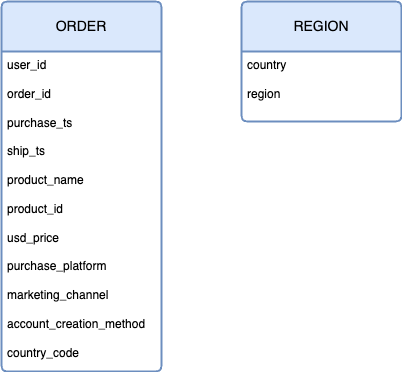

# Game Store Sales Analysis 

## Project overview

### Objective  
To analyze historical sales data from a game store and uncover insights regarding sales trends, product performance, regional behaviors, and marketing effectiveness to support better commercial and strategic decisions.

### Business context  
The store operates across several global regions with both online (website, mobile) and offline (in-store) sales channels. Understanding how sales vary over time and across regions, platforms, and marketing channels is essential for **allocating resources**, **planning seasonal promotions**, and **targeting customer segments more effectively**.

---

## Dataset structure

The analysis was based on an Excel file with two sheets:

### 1. `orders`

### 2. `region`
A reference sheet mapping country codes to broader regions (e.g., NA, EMEA, APAC)

---

## Data cleaning summary

An **issue log** was created to document data quality issues and solutions:

| Table | Column(s) | Issue | Rows affected | Magnitude | Solvable | Resolution |
|-------|-----------|-------|----------------|----|---------|------------|
| orders | `purchase_ts` | Inconsistent formats | 10 | 0.05% | ✅ | used `DATE` functions to reformat the dates correctly|
| orders | `purchase_ts` | Missing | 1 | 0.00% | ❌ | Left as-is (low magnitude and no way to infer) |
| orders | `product_name` | Spelling inconsistency | 61 | 0.28% | ✅ | Standardized naming |
| orders | `product_id` | Inconsistent format | 722 | 3.30% | ✅ | Used `TEXT` functions to reformat correctly|
| orders | `usd_price` | Missing / 0 value | 34 | 0.16% | ❌ | Flagged for review |
| orders | `marketing_channel` | Missing | 83 | 0.38% | ✅ | Replaced with "unknown" |
| orders | `account_creation_method` | Missing | 83 | 0.38% | ✅ | Replaced with "unknown" |
| orders | `country_code` | Missing | 37 | 0.17% | ❌ | Left as-is (no way to infer, need to check with stakeholders |
| regions | `region` | Invalid / missing | 9 | 0.04% | ✅ | Filled via lookup |
| orders | `purchase_ts`, `ship_ts` | Ship before purchase | 2,000 | 9.15% | ❌ | Flagged only |
| orders | all | Duplicate order_id | 145 | 0.66% | ⚠️ | Not removed (low impact) |
| orders | `user_id` | Recognized as overly large number | 3 | 0.01% | ❌ | Left as-is (no way to infer, need to check with stakeholders |

---

## Insights Summary

### 1. Revenue over time
- **Steady YoY growth** in revenue observed.
- Clear **seasonal peaks** in **September** and **December**, especially December (likely due to Christmas and year-end sales).

### 2. Platform & marketing channel performance
- **Website is the top-performing platform**, followed by mobile.
- **In-person selling remains the most effective marketing channel**, outperforming email, referral, and paid ads in conversion and revenue.

### 3. Regional performance
- **North America (NA)** is the best-performing region in both revenue and number of orders, followed by **EMEA**.
- Within NA:
  - 🇺🇸 **USA dominates** in both order volume and revenue.
  - 🇨🇦 **Canada** follows as a strong secondary market.

### 4. Best-selling products by region
- Regional best-sellers vary, but **27" 4K Gaming Monitor** consistently performs well in NA and EMEA.
- Product bundling and accessories show potential in underperforming regions.

### 5. Shipping time analysis
- **Average delivery time varies by region**:
  - NA: fastest (likely due to local logistics)
  - APAC & LATAM: longer delivery time, potential logistics bottlenecks

### 6. Marketing channel trend
- **Direct selling is stable and consistently high-performing**.
- **Email marketing usage is increasing**, but conversion rate not significantly improving.
- **Referral and paid ads** show fluctuating trends, suggesting inconsistent execution.

---

## Recommendations

### Revenue growth strategy
- **Double down on December promotions** using high-conversion channels like in-person and website to maximize seasonal peaks.
- Consider **pre-season bundles and email reminders** starting early November.

### Regional expansion
- **Replicate successful US strategies** (product mix, platform/channel) to other high-potential markets like Canada and the UK.
- For regions with long shipping delays (e.g., LATAM, APAC), explore **logistics partners or local fulfillment options**.

### Marketing optimization
- Allocate more budget to **direct sales support and website UX improvements**.
- **Reevaluate paid ads and email strategies** — focus on audience segmentation, A/B testing and ROI tracking.
- Invest in **data collection for missing marketing data** to better measure effectiveness across channels.

### Operational improvement
- Flag and monitor **orders with `ship_ts < purchase_ts`** in future systems.
- Implement **basic validation rules at the data entry stage** to minimize manual cleaning.

---

## Tools used
- Microsoft Excel (Pivot Tables, Power Query, Date/Logic/Text functions)
- Manual lookup & data enrichment for missing region info
